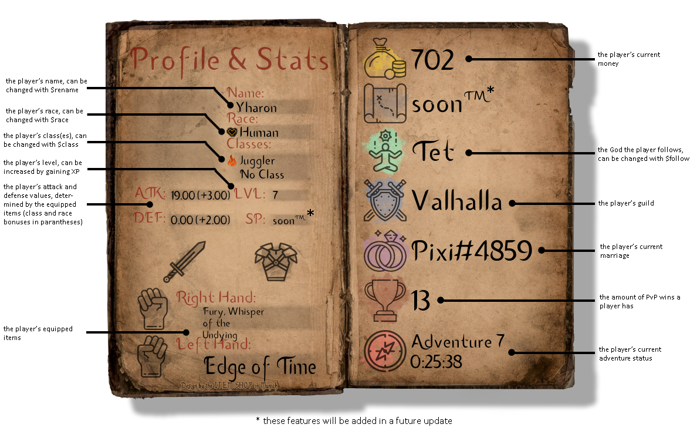

# Getting started

Hello! Welcome to the guidebook for the IdleRPG Bot. This bot is mainly focused around an adventure-style text-based game.  
So, you've just heard of this bot and don't know how to get started? We've got you covered!

Go [here]() to learn how to invite this bot to your server if you haven't already! To get started, you can use `$create [name]` to create your character and begin your journey!  
After creating your character, you can use `$profile`, or just `$p` to view your character’s profile. You'll be shown your character name, and all of the character stats you need to know, such as attack and defense stats, and the amount of money you have. Here is a quick explanation of what each value means:

If this profile is too complicated, takes too long to load, or you simply don't like it, IdleRPG offers `$profile2`, or `$pp` to view a shorter version, packed into an embed.
