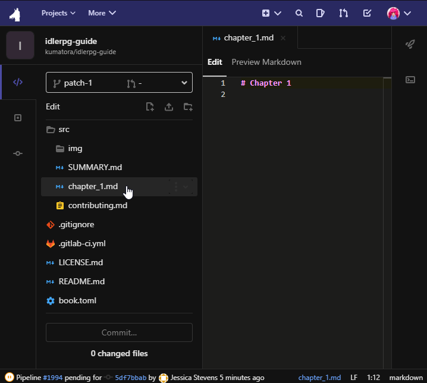

# Contributing with GitLab alone

GitLab offers other ways of contributing if you cannot install Git on your system.
The [Web Editor](https://docs.gitlab.com/ee/user/project/repository/web_editor.html) and the powerful [Web IDE](https://docs.gitlab.com/ee/user/project/web_ide/) provide a way of contributing to those, who can only use their browser.

Once you have created your user account on [our GitLab](https://git.travitia.xyz/) and read the main [Contributing page](./contributing.md), you're ready to go!

## Forking the project

As regular users don't have file editing permissions in the main repository, you should create a fork - your own copy of the repository - to make changes.
Those changes/additions can later be added into the main repository via **Merge Requests**.

To fork the repository, go to the [main one](https://git.travitia.xyz/Kenvyra/idlerpg-guide) and find the button labelled "Fork" toward the top right.
Once you click it, you'll be prompted to select a "namespace".
Simply select your user account, and GitLab will create a fork of the repository for you.
This could take a minute or two.

From here, you have two options:

1. Using the Web Editor
   - This is usually not as ressource intensive but makes editing files a bit slower
   - Editing more than one file at once is also not possible, requiring multiple commits
2. Using the Web IDE
   - IDE stands for _integrated development environment_
   - The IDE requires more ressources, but is also a more powerful tool
   - With the IDE, you can preview formatted Markdown right as you write it

For a sense of completion, I will cover both methods here.

> Note: The following steps are all performed in the [main repository](https://git.travitia.xyz/Kenvyra/idlerpg-guide). Find and edit the files there, GitLab will automatically figure out the rest. This will make creating merge requests much easier.

## Using the Web Editor

To edit files using GitLab's Web Editor is as simple as finding the file and pressing the "Edit" button. You'll be brought into a simple window where you can make changes to your liking.

Once you've done all the changes you wanted, you should find the "Commit Message" field at the bottom. Write a short message of what you did and press the "Commit Changes" button.

After commiting the changes, you'll be brought to a New Merge Request page, what do to from here is discussed further below.

## Using the Web IDE

The process of using the Web IDE to edit files is nearly identical. Find the file you'd like to edit and click the "Web IDE" button next to the "Edit" button. You'll be brought to the IDE page.

On the left is the _file tree_. From here, you can select the files you want to edit by simply clicking them. On the right is the text editor. Here, you can write your text (keeping Markdown in mind). If at any point you'd like to see what your text will look like when it's formatted, use the "Preview Markdown" button at the top.

If you start changing files, you'll notice that the X next to the file name turns into an orange square. This simply means that the IDE knows this file was changed from what it was before.

Once all changes have been made, you should click "Commit..." at the bottom of the file tree. On the right, you're shown all changes, so you can make sure everything is right. If everything is the way it should, write a short commit message, select branch "patch-1" (this could say another number for you), tick "Start a new merge request", and finally click commit.

## Opening the merge request

Once you're on the Merge Request screen, you'll see a title and a description field. Make sure to fill in the title field with a short message of what you changed. The description _could_ include your name (so we can add you to the book authors) among other details.

If that's filled in, hit "Submit Merge Request". From this point on, it's our responsibility to quality check and merge the request. This will add the code to the main repository and update the actual guidebook online.
